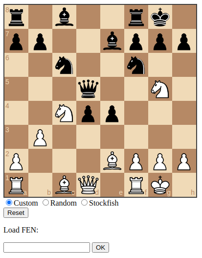

# Chess
Repository for implementing different chess engines on the web

Currently implemented engines:
- Stockfish
    - The strongest open-source chess engine currently available
    - Implemented with WebAssembly
- Random
    - Engine that makes a random (legal) move
- Custom
    - Custom engine that uses piece-square tables and an optimized version of the minimax algorithm

